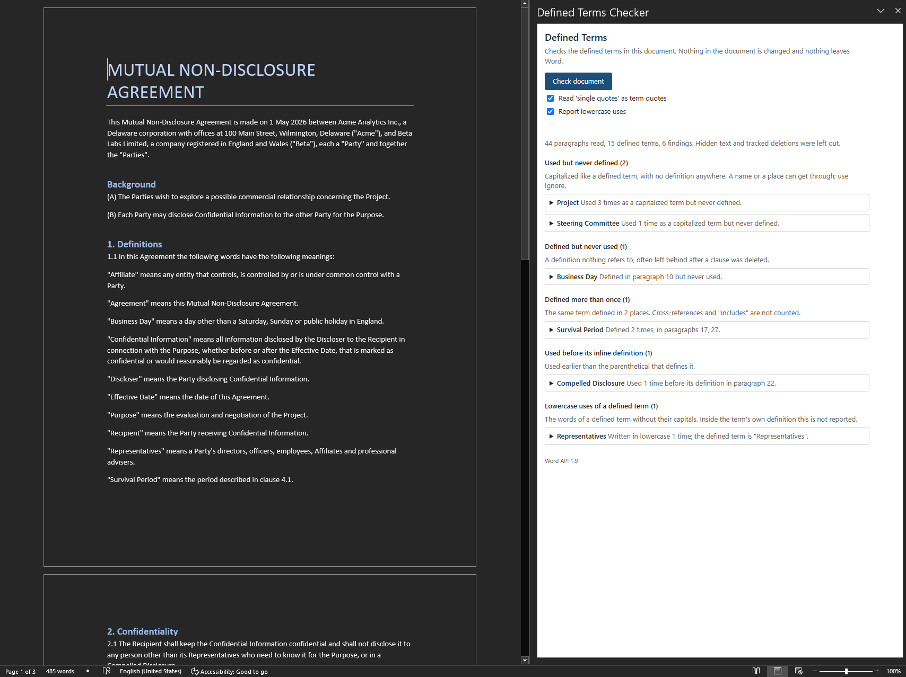

# Defined Terms Checker

A Word add-in that reads a contract and lists what is wrong with its defined terms: terms used but never
defined, defined but never used, defined twice, used before the parenthetical that defines them, and
written in lowercase. It does not change the document and nothing leaves Word.



The rules follow Adams' _A Manual of Style for Contract Drafting_ and skip the usual false positives: the
first word of a sentence, headings, party names, "Section 3", "the State of Delaware" and all-caps clauses.

## What it finds

| Finding                           | What it means                                                                                                                        | In `samples/sample-nda.docx`                |
| --------------------------------- | ------------------------------------------------------------------------------------------------------------------------------------ | ------------------------------------------- |
| Used but never defined            | A capitalized term with no definition anywhere. A single word needs 2 uses, a phrase 1.                                              | "Project" (3 uses) and "Steering Committee" |
| Defined but never used            | A definition nothing refers to, usually left behind when a clause was deleted or pasted in from another document                     | "Business Day"                              |
| Defined more than once            | 2 full definitions of one term. Cross-references ("has the meaning given in clause 3") and "includes" do not count                   | "Survival Period"                           |
| Used before its inline definition | Used earlier than the parenthetical that defines it                                                                                  | "Compelled Disclosure"                      |
| Lowercase uses                    | The words of a defined term without their capitals. Not reported inside the term's own definition ("Agreement" means this agreement) | "representatives"                           |

Each finding lists its occurrences with a bit of context. Clicking one selects the text in the document. A
term can be put on an ignore list, kept per document.

## Try it

You need Node 20 or newer and Word (Microsoft 365 on Windows or Mac, or Word on the web).

```bash
npm install
npm start
```

`npm start` builds the add-in, serves it from `https://localhost:3000` and sideloads it into desktop Word.
The first run asks to trust a development certificate from the Office add-in tooling. Open
`samples/sample-nda.docx`, go to the Home tab, click **Check Terms**, then **Check document**. You should
see the 6 findings in the table above. `npm run stop` removes the sideloaded add-in.

If `npm start` cannot launch Word, run `npm run dev-server` and sideload `manifest.xml` by hand. Microsoft's
page "Sideload Office Add-ins for testing" covers Windows, Mac and the web.

## How it works

`src/core` is plain TypeScript with no Office dependency: paragraphs in, findings out, all tested in Node.
`src/office` reads the paragraphs and selects a finding, and `src/taskpane` draws the pane. The rules and
the reasons for them are in [docs/design.md](docs/design.md).

## What it does not do

- It never writes to the document, so nothing shows up in the redline.
- Body text only. Headers, footers, footnotes, comments and text boxes are not read.
- It does not read bold, so `(the Products)` in bold with no quotes counts only as a weak definition.
- English only.
- Committee, court and product names it does not know show up as undefined. Use Ignore for those.

## Commands

`npm test` (98 tests), `npm run lint`, `npm run typecheck`, `npm run build` (about 38 KB of JavaScript in
`dist/`), `npm run validate` (the manifest), `npm start` and `npm run stop`. To host the add-in somewhere
other than localhost, set `ADDIN_URL` for the build: `ADDIN_URL=https://example.com/terms/ npm run build`
rewrites the URLs in `dist/manifest.xml`.

## License

MIT.
